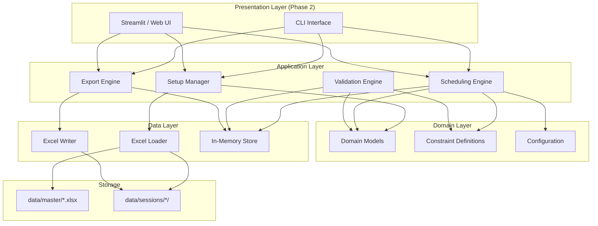
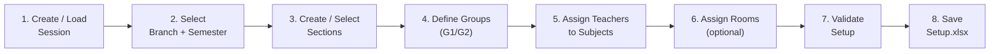
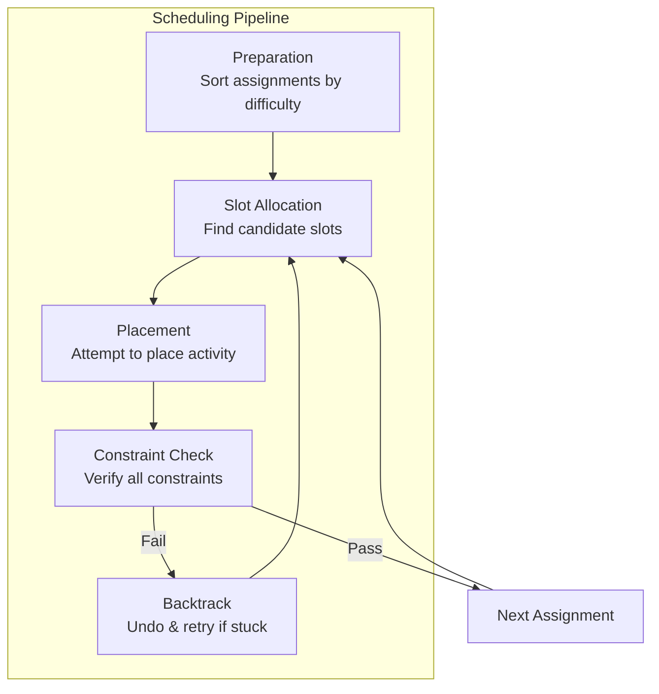
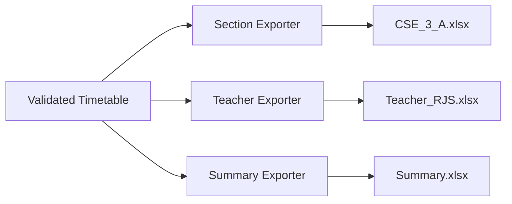

# System Architecture

> **Version:** 1.0-DRAFT  
> **Date:** 2026-08-30  
> **Companion to:** `PROJECT_SPEC.md`, `DATA_SCHEMA.md`

---

## 1. Architecture Overview

The system follows a **layered architecture** with clear separation between data access, business logic (scheduling engine), and I/O (import/export).



---

## 2. Module Structure

```
college_timetable/
├── __init__.py
├── main.py                      # Entry point (CLI)
├── config.py                    # Global configuration & configurable parameters
│
├── models/                      # Domain models (dataclasses)
│   ├── __init__.py
│   ├── teacher.py               # Teacher entity
│   ├── room.py                  # Room entity
│   ├── subject.py               # Subject entity
│   ├── workload.py              # Workload entry
│   ├── assignment.py            # Teacher-Subject-Section assignment
│   ├── slot.py                  # TimeSlot (day, period) value object
│   ├── placement.py             # A scheduled activity in a slot
│   └── timetable.py             # Timetable grid (collection of placements)
│
├── data/                        # Data access layer
│   ├── __init__.py
│   ├── loader.py                # Read Excel master/session files → models
│   ├── writer.py                # Write timetable models → Excel files
│   └── validators.py            # Master data integrity checks
│
├── setup/                       # Timetable setup workflow
│   ├── __init__.py
│   ├── session_manager.py       # Create/load scheduling sessions
│   ├── section_manager.py       # Create sections and groups
│   └── assignment_manager.py    # Teacher-subject assignments
│
├── engine/                      # Core scheduling engine
│   ├── __init__.py
│   ├── scheduler.py             # Main scheduling orchestrator
│   ├── slot_allocator.py        # Slot selection and placement logic
│   ├── block_placer.py          # Consecutive-slot block placement
│   └── backtracker.py           # Backtracking / retry logic
│
├── constraints/                 # Constraint system
│   ├── __init__.py
│   ├── base.py                  # Abstract constraint interface
│   ├── teacher_conflict.py      # C1: No teacher double-booking
│   ├── room_conflict.py         # C2: No room double-booking
│   ├── section_conflict.py      # C3: No section/group double-booking
│   ├── workload_constraint.py   # C4: Weekly workload fulfilment
│   ├── block_constraint.py      # C5: Consecutive slot enforcement
│   ├── parallel_group.py        # C6: G1/G2 parallel alignment
│   ├── room_eligibility.py      # C7: Room-type matching
│   └── soft_constraints.py      # Soft limits (daily load, distribution)
│
├── validation/                  # Post-generation validation
│   ├── __init__.py
│   ├── timetable_validator.py   # Full validation orchestrator
│   ├── conflict_checker.py      # Re-check all hard constraints
│   └── workload_auditor.py      # Verify all workloads are met
│
└── export/                      # Output generation
    ├── __init__.py              # Public API (TimetableExporter, build_views, …)
    ├── grid.py                  # Weekly time grid (days, periods, lunch)
    ├── context.py               # ExportContext: master-data lookup + session meta
    ├── conflicts.py             # Independent C1–C3/C6 audit → ConflictReport
    ├── views.py                 # Placement → GridView models (5 view kinds)
    ├── rebuild.py               # Serialized JSON result → Placement objects
    ├── service.py               # TimetableExporter orchestration (CSV/XLSX/PDF)
    ├── csv_exporter.py          # Grid CSVs, flat CSV, conflicts, unscheduled
    ├── xlsx_exporter.py         # openpyxl: merged blocks, colours, conflict sheet
    └── pdf_exporter.py          # reportlab: audit page + one page per entity
```

### 3.7.1 Export views and formats

`TimetableExporter` (in `export/service.py`) is the single entry point
used by the Flask API and batch scripts.  Pipeline:

```
placements ──► conflict audit ──► view models ──► CSV / XLSX / PDF
```

| View | Entity | One file contains |
|---|---|---|
| `class` | branch-semester (e.g. `CSE-3`) | all sections stacked per cell |
| `section` | section (e.g. `CSE-3-A`) | the student grid; parallel G1/G2 as labelled lines in one cell |
| `group` | section+group (e.g. `CSE-3-A-G1`) | ALL + own-group activities; dimmed "Parallel G2: …" notes |
| `teacher` | teacher | every engagement across sections |
| `room` | room | full room occupancy |

Formats: **CSV** (grid per view + flat long-format + conflicts +
unscheduled), **XLSX** (one workbook per view, one sheet per entity,
merged practical blocks, colour-coded activities, trailing Conflicts
sheet), **PDF** (one landscape document per view: audit page + one page
per entity).

Practical blocks merge across their period columns **only when the
columns are exclusively their own**; overlapping blocks (two sections
in the class view, or a conflicting placement) repeat their content in
every covered column instead — nothing is ever hidden.  Every export
embeds the results of an independent hard-constraint audit: conflicts
are flagged inline on the offending cells and listed in full, and
unscheduled sessions are reported.  No hidden conflicts.

---

## 3. Module Descriptions

### 3.1 `models/` — Domain Models

All entities are Python **dataclasses** (or Pydantic models). They are pure data containers with no I/O or scheduling logic.

#### Key Models

```python
@dataclass
class Teacher:
    teacher_id: str          # "T001"
    teacher_name: str        # "RJS"
    department: str          # "CSE"
    active: bool

@dataclass
class Room:
    room_id: str             # "R001"
    room_name: str           # "CC1"
    room_type: RoomType      # LAB | LECTURE | DRAWING_HALL | WORKSHOP
    branch: Optional[str]    # "CSE" for labs, None for shared
    is_shared: bool
    active: bool

@dataclass
class Subject:
    subject_id: str          # "SUB001"
    subject_code: str        # "1.4"
    subject_name: str        # "Fundamentals of IT"
    branch: str
    semester: int
    active: bool

@dataclass
class Workload:
    workload_id: str         # "W001"
    subject_id: str          # FK → "SUB001"
    branch: str              # Denormalised
    semester: int             # Denormalised
    lecture_periods_per_week: int
    practical_periods_per_week: int
    total_periods_per_week: int

@dataclass(frozen=True)
class TimeSlot:
    day: Day                 # MON | TUE | WED | THU | FRI
    period: int              # 1–7

@dataclass
class Assignment:
    assignment_id: str
    session_id: str
    teacher_id: str
    subject_id: str
    branch: str
    semester: int
    section: str             # "A"
    group: str               # "G1" | "G2" | "ALL"
    activity_type: ActivityType
    room_id: Optional[str]
    block_size: int
    sessions_per_week: int

@dataclass
class Placement:
    placement_id: str
    assignment: Assignment
    slots: List[TimeSlot]    # List of consecutive slots for this session
    room_id: str             # Resolved room
```

#### Enumerations

```python
class RoomType(Enum):
    LAB = "LAB"
    LECTURE = "LECTURE"
    DRAWING_HALL = "DRAWING_HALL"
    WORKSHOP = "WORKSHOP"

class ActivityType(Enum):
    LECTURE = "LECTURE"
    PRACTICAL = "PRACTICAL"
    WORKSHOP = "WORKSHOP"
    DRAWING = "DRAWING"
    PROJECT = "PROJECT"
    TRAINING = "TRAINING"

class Day(Enum):
    MON = "Monday"
    TUE = "Tuesday"
    WED = "Wednesday"
    THU = "Thursday"
    FRI = "Friday"
```

---

### 3.2 `data/` — Data Access Layer

#### `loader.py`

Reads Excel files using `openpyxl` and returns lists of domain model instances.

```python
class DataLoader:
    def load_teachers(path: str) -> List[Teacher]
    def load_rooms(path: str) -> List[Room]
    def load_subjects(path: str) -> List[Subject]
    def load_workloads(path: str) -> List[Workload]
    def load_assignments(path: str) -> List[Assignment]
```

#### `writer.py`

Writes domain models back to Excel using `openpyxl`.

```python
class DataWriter:
    def write_timetable_section(timetable: Timetable, path: str) -> None
    def write_timetable_teacher(teacher_schedule: TeacherSchedule, path: str) -> None
    def write_summary(summary: ScheduleSummary, path: str) -> None
```

#### `validators.py`

Master data integrity checks (V-T1 through V-W2 from `DATA_SCHEMA.md`).

```python
class DataValidator:
    def validate_teachers(teachers: List[Teacher]) -> List[ValidationError]
    def validate_rooms(rooms: List[Room]) -> List[ValidationError]
    def validate_subjects(subjects: List[Subject]) -> List[ValidationError]
    def validate_workloads(workloads: List[Workload],
                           subjects: List[Subject]) -> List[ValidationError]
    def validate_assignments(assignments: List[Assignment],
                             teachers: List[Teacher],
                             subjects: List[Subject],
                             workloads: List[Workload],
                             rooms: List[Room]) -> List[ValidationError]
```

---

### 3.3 `setup/` — Timetable Setup Workflow

The setup module orchestrates the interactive process before scheduling begins.



#### `session_manager.py`

```python
class SessionManager:
    def create_session(session_id: str) -> Session
    def load_session(session_id: str) -> Session
    def list_sessions() -> List[str]
```

#### `section_manager.py`

```python
class SectionManager:
    def create_section(branch: str, semester: int, label: str) -> Section
    def add_groups(section: Section, groups: List[str]) -> None  # ["G1", "G2"]
    def list_sections(session: Session) -> List[Section]
```

#### `assignment_manager.py`

```python
class AssignmentManager:
    def create_assignment(teacher_id, subject_id, section, group,
                          activity_type, room_id=None, block_size=None,
                          sessions_per_week=None) -> Assignment
    def validate_assignments(assignments: List[Assignment]) -> List[ValidationError]
    def save_assignments(session: Session, assignments: List[Assignment]) -> None
```

---

### 3.4 `engine/` — Scheduling Engine

The heart of the system. Uses a **constraint-satisfaction with backtracking** approach.

#### Architecture



#### `scheduler.py` — Main Orchestrator

```python
class Scheduler:
    def __init__(self, assignments: List[Assignment],
                 constraints: List[Constraint],
                 config: SchedulerConfig):
        ...

    def schedule(self) -> ScheduleResult:
        """
        Main entry point.
        Returns ScheduleResult with:
          - timetable: Timetable (if successful)
          - success: bool
          - unplaced: List[Assignment] (if failed)
          - stats: SchedulingStats
        """

    def _sort_assignments(self) -> List[Assignment]:
        """
        Sort by scheduling difficulty:
        1. Block practicals (hardest — need consecutive slots)
        2. Group-parallel practicals
        3. Single-slot practicals
        4. Lectures (most flexible)
        """

    def _find_candidates(self, assignment: Assignment) -> List[CandidateSlot]:
        """Return all valid (day, start_slot, room) tuples for this assignment."""

    def _place(self, assignment: Assignment, candidate: CandidateSlot) -> bool:
        """Attempt placement, return True if all constraints pass."""
```

#### `slot_allocator.py`

```python
class SlotAllocator:
    def get_available_slots(self, day: Day, block_size: int,
                            constraints: ConstraintContext) -> List[SlotRange]:
        """
        Return slot ranges on a given day that can accommodate
        a block of the requested size, respecting the lunch break.
        """

    def get_all_candidate_slots(self, block_size: int) -> List[SlotRange]:
        """Generate all possible (day, slot_range) across the week."""
```

**Valid block positions (for block_size=2, no lunch spanning):**

| Block Start | Block End | Valid? |
|---|---|---|
| Slot 1 | Slot 2 | ✅ |
| Slot 2 | Slot 3 | ✅ |
| Slot 3 | Slot 4 | ✅ |
| Slot 4 | Slot 5 | ❌ (crosses lunch) |
| Slot 5 | Slot 6 | ✅ |
| Slot 6 | Slot 7 | ✅ |

#### `block_placer.py`

```python
class BlockPlacer:
    def place_block(self, assignment: Assignment, day: Day,
                    start_slot: int, room_id: str) -> List[Placement]:
        """
        Create Placement objects for a consecutive block.
        For block_size=2 starting at slot 3:
          → [Placement(slot=3), Placement(slot=4)]
        """

    def place_parallel_groups(self, g1_assignment: Assignment,
                               g2_assignment: Assignment,
                               day: Day, start_slot: int,
                               g1_room: str, g2_room: str) -> List[Placement]:
        """Place G1 and G2 practicals in the same slot range."""
```

#### `backtracker.py`

```python
class Backtracker:
    def __init__(self, max_retries: int = 1000):
        ...

    def record_placement(self, placement: Placement) -> None
    def undo_last(self) -> Optional[Placement]
    def undo_to_checkpoint(self, checkpoint: int) -> List[Placement]
    def should_give_up(self) -> bool
```

---

### 3.5 `constraints/` — Constraint System

Each constraint implements a common interface:

```python
class Constraint(ABC):
    """Base class for all scheduling constraints."""

    @abstractmethod
    def check(self, placement: Placement, state: ScheduleState) -> ConstraintResult:
        """
        Check if a proposed placement violates this constraint.
        Returns ConstraintResult(passed=bool, message=str)
        """

    @property
    @abstractmethod
    def is_hard(self) -> bool:
        """Hard constraints must never be violated. Soft constraints are best-effort."""
```

#### Constraint Registry

```python
class ConstraintRegistry:
    def __init__(self):
        self._hard: List[Constraint] = []
        self._soft: List[Constraint] = []

    def register(self, constraint: Constraint) -> None
    def check_all_hard(self, placement, state) -> List[ConstraintResult]
    def check_all_soft(self, placement, state) -> List[ConstraintResult]
    def score(self, placement, state) -> float  # For soft-constraint optimization
```

#### Individual Constraints

| File | Constraint ID | Type | Logic |
|---|---|---|---|
| `teacher_conflict.py` | C1 | Hard | `state.teacher_slots[teacher_id]` must not contain any slot in the proposed range. |
| `room_conflict.py` | C2 | Hard | `state.room_slots[room_id]` must not contain any slot in the proposed range. |
| `section_conflict.py` | C3 | Hard | `state.section_slots[section][group]` must not contain any slot in the proposed range. For `group=ALL`, check both G1 and G2 as well. |
| `workload_constraint.py` | C4 | Hard | After all placements, `count(placements for subject-section) == required_sessions_per_week`. |
| `block_constraint.py` | C5 | Hard | All slots in a placement must be consecutive, same day, and not span lunch (unless configured). |
| `parallel_group.py` | C6 | Hard | If G1 is placed at (day, slot_range), G2 for the same subject-section must occupy the exact same (day, slot_range). |
| `room_eligibility.py` | C7 | Hard | `LECTURE` → room_type in {LECTURE}. `PRACTICAL` → room_type in {LAB} and room.branch matches. `WORKSHOP` → room_type in {WORKSHOP}. `DRAWING` → room_type in {DRAWING_HALL}. |
| `soft_constraints.py` | S1–S3 | Soft | Daily limits, even distribution across days, teacher preference windows. |

---

### 3.6 `validation/` — Post-Generation Validation

Runs after the engine completes. Performs an independent full re-check.

```python
class TimetableValidator:
    def validate(self, timetable: Timetable,
                 assignments: List[Assignment],
                 teachers: List[Teacher],
                 rooms: List[Room]) -> ValidationReport:
        """
        Run all validation checks and return a comprehensive report.
        """

class ValidationReport:
    errors: List[ValidationError]      # Hard constraint violations — timetable is INVALID
    warnings: List[ValidationWarning]  # Soft constraint violations — timetable is valid but suboptimal
    stats: ValidationStats             # Summary metrics

    @property
    def is_valid(self) -> bool:
        return len(self.errors) == 0
```

**Validation checks:**

| Check | Type | Description |
|---|---|---|
| VT-1 | Error | Any teacher has overlapping placements. |
| VT-2 | Error | Any room has overlapping placements. |
| VT-3 | Error | Any section/group has overlapping placements. |
| VT-4 | Error | Any subject's weekly workload is under- or over-scheduled. |
| VT-5 | Error | Any practical block is non-consecutive or spans lunch. |
| VT-6 | Error | G1/G2 parallel practicals are not aligned. |
| VT-7 | Error | Room type mismatch for activity type. |
| VT-8 | Warning | Teacher exceeds daily period limit. |
| VT-9 | Warning | Section exceeds daily lecture limit. |
| VT-10 | Warning | Uneven distribution of subjects across the week. |

---

### 3.7 `export/` — Output Generation



#### `section_exporter.py`

Generates one Excel file per section with the weekly grid format. Each cell contains:
- Subject short name
- Teacher initials
- Room name
- Group (if not ALL)

Formatting: colour-coded by activity type, merged cells for multi-slot blocks.

#### `teacher_exporter.py`

Generates one Excel file per teacher showing their full weekly schedule across all assigned sections.

#### `summary_exporter.py`

Generates:
- Room utilisation matrix (room × slot → occupancy)
- Teacher workload summary (teacher → total periods, per-day breakdown)
- Unscheduled/free-slot analysis

---

## 4. State Management

### 4.1 `ScheduleState`

The central mutable state object during scheduling. Provides O(1) conflict lookups.

```python
class ScheduleState:
    """Tracks all placed activities for fast constraint checking."""

    # Occupancy maps: entity_id → Set[TimeSlot]
    teacher_slots: Dict[str, Set[TimeSlot]]
    room_slots: Dict[str, Set[TimeSlot]]
    section_slots: Dict[str, Dict[str, Set[TimeSlot]]]  # section → group → slots

    # Workload tracking: (subject_id, section, group) → sessions_placed
    workload_counter: Dict[Tuple[str, str, str], int]

    # All placements (for undo / export)
    placements: List[Placement]

    def add_placement(self, p: Placement) -> None: ...
    def remove_placement(self, p: Placement) -> None: ...
    def is_teacher_free(self, teacher_id: str, slots: List[TimeSlot]) -> bool: ...
    def is_room_free(self, room_id: str, slots: List[TimeSlot]) -> bool: ...
    def is_section_free(self, section: str, group: str, slots: List[TimeSlot]) -> bool: ...
```

---

## 5. Configuration System

All configurable parameters from `PROJECT_SPEC.md` are centralised in `config.py`.

```python
@dataclass
class SchedulerConfig:
    # --- Block sizes (CONFIGURABLE — unresolved business rules) ---
    practical_block_size: int = 2
    workshop_block_size: int = 3
    drawing_block_size: int = 3

    # --- Soft limits ---
    max_lectures_per_day: int = 5
    max_periods_per_day_teacher: int = 6

    # --- Behaviour flags ---
    allow_lunch_span: bool = False
    schedule_sca: bool = False
    schedule_moocs: bool = False

    # --- Engine tuning ---
    max_backtrack_attempts: int = 1000
    randomize_candidates: bool = True  # Add randomness to avoid always same output

    # --- Paths ---
    master_data_dir: str = "data/master"
    sessions_dir: str = "data/sessions"
```

---

## 6. Technology Stack

| Component | Technology | Rationale |
|---|---|---|
| Language | Python 3.10+ | Requirement; rich ecosystem for data processing. |
| Excel I/O | `openpyxl` | Already in use; supports .xlsx read/write with formatting. |
| Data models | `dataclasses` or `pydantic` | Lightweight, type-safe. Pydantic adds built-in validation. |
| CLI | `click` or `argparse` | For Phase 1 command-line interface. |
| Testing | `pytest` | Standard Python testing framework. |
| UI (Phase 2) | `Streamlit` | Rapid prototyping for data-centric apps. |
| Packaging | `pyproject.toml` + `pip` | Modern Python packaging. |

---

## 7. Error Handling Strategy

```python
class TimetableError(Exception):
    """Base exception for the timetable system."""

class DataLoadError(TimetableError):
    """Raised when master data cannot be loaded or parsed."""

class ValidationError(TimetableError):
    """Raised when data validation fails."""

class SchedulingError(TimetableError):
    """Raised when the scheduler cannot find a valid placement."""

class ExportError(TimetableError):
    """Raised when timetable export fails."""
```

All errors carry structured context (entity IDs, slot info, constraint violated) for actionable diagnostics.

---

## 8. Extensibility Points

| Extension | Mechanism |
|---|---|
| New constraint types | Implement `Constraint` ABC, register in `ConstraintRegistry`. |
| New room types | Add value to `RoomType` enum, update `room_eligibility.py`. |
| New activity types | Add value to `ActivityType` enum, update constraint handlers. |
| New export formats | Add new exporter implementing a common `Exporter` interface. |
| Alternative scheduling algorithms | Replace/extend `scheduler.py` (e.g., genetic algorithm, ILP solver). |
| Database backend | Replace `loader.py`/`writer.py` with database adapters; models remain unchanged. |
