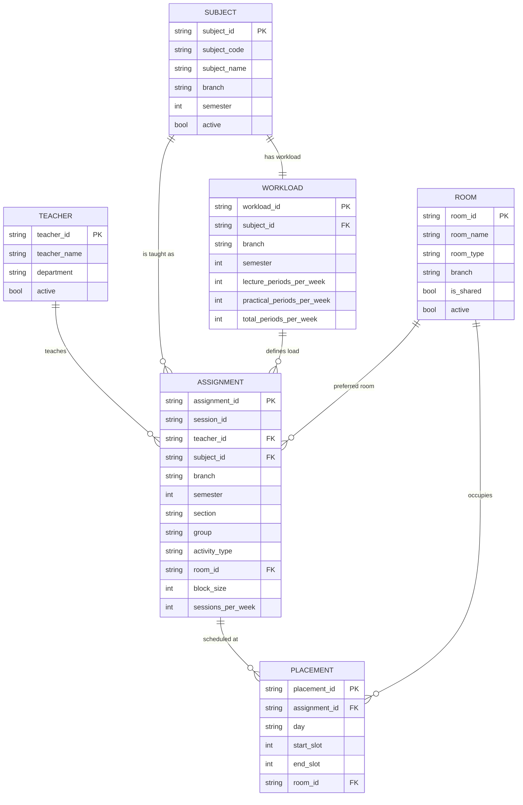

# Data Schema Specification

> **Version:** 1.0-DRAFT  
> **Date:** 2026-08-30  
> **Companion to:** `PROJECT_SPEC.md`

---

## 1. Overview

All master data lives in **normalised Excel workbooks** under `Data/`.  
Each file contains a single sheet with a header row in Row 1.  
Transient per-term data (assignments, generated timetables) will live under `data/sessions/`.

**Current directory structure:**

```
College_TimeTable_Project/
├── Data/
│   ├── teachers.xlsx        # Teacher roster (68 rows)
│   ├── rooms.xlsx           # Room / lab / hall inventory (41 rows)
│   ├── subjects.xlsx        # Subject catalogue per branch-semester (193 rows)
│   └── workloads.xlsx       # Weekly L + P periods per subject (193 rows)
├── docs/
│   ├── PROJECT_SPEC.md
│   ├── DATA_SCHEMA.md       # (this file)
│   ├── ARCHITECTURE.md
│   ├── SCHEDULING_RULES.md
│   └── FUTURE_ROADMAP.md
└── data/
    └── sessions/            # (to be created at runtime)
        └── <session_id>/    # e.g. "2026-odd" or "2026-even"
            ├── Setup.xlsx   # Teacher-subject-section assignments for this term
            └── Timetables/  # Generated output files
                ├── CSE_3_A.xlsx
                ├── Teacher_RJS.xlsx
                └── ...
```

---

## 2. Master Data Schemas

### 2.1 `Teachers.xlsx`

One row per teacher. Existing file at `Data/teachers.xlsx` already follows this structure.

| Column | Name | Type | Required | Description |
|---|---|---|---|---|
| A | `teacher_id` | `str` | ✅ | Unique ID, e.g. `T001`. |
| B | `teacher_name` | `str` | ✅ | Short name / initials, e.g. `RJS`. |
| C | `department` | `str` | ✅ | Home department. One of: `CSE`, `EE`, `ECE`, `ME`, `Civil`, `Applied Science`, `Workshop`. |
| D | `active` | `bool` | ✅ | `TRUE` if available for assignment this term. |

> [!NOTE]
> **Visiting Faculty (VF):** Teachers named `VF1`–`VF5` appear in every department as placeholders.  
> They share the same short-name across departments but have **distinct `teacher_id` values** (e.g., `T020` = EE/VF1, `T037` = ME/VF1).  
> The system treats each `teacher_id` as a unique person — no implicit cross-department identity.

**Observed data summary (from `Data/teachers.xlsx`):**

| Department | Count (incl. VF) | Regular Staff | VF Placeholders |
|---|---|---|---|
| CSE | 12 | 12 | 0 |
| EE | 12 | 7 | 5 |
| ECE | 8 | 8 | 0 |
| ME | 9 | 4 | 5 |
| Civil | 9 | 4 | 5 |
| Applied Science | 9 | 4 | 5 |
| Workshop | 9 | 4 | 5 |
| **Total** | **68** | **43** | **25** |

---

### 2.2 `Rooms.xlsx`

One row per room / lab / hall. Existing file at `Data/rooms.xlsx` already follows this structure.

| Column | Name | Type | Required | Description |
|---|---|---|---|---|
| A | `room_id` | `str` | ✅ | Unique ID, e.g. `R001`. |
| B | `room_name` | `str` | ✅ | Display name, e.g. `CC1`, `L5`, `DH2`. |
| C | `room_type` | `str` | ✅ | One of: `LAB`, `LECTURE`, `DRAWING_HALL`, `WORKSHOP`. |
| D | `branch` | `str` | ❌ | Owning branch for labs (e.g. `CSE`). `NULL` for shared rooms. |
| E | `is_shared` | `bool` | ✅ | `TRUE` for lecture halls, drawing halls, and workshop rooms. `FALSE` for branch-specific labs. |
| F | `active` | `bool` | ✅ | `TRUE` if available for scheduling. |

> [!IMPORTANT]
> **Workshop rooms** are not currently present in the rooms file.  
> The system must support adding `WORKSHOP`-type rooms when the data is available.

**Room inventory summary (from `Data/rooms.xlsx`):**

| Room Type | Count | Details |
|---|---|---|
| LAB (CSE) | 6 | CC1–CC5, IOT |
| LAB (EE) | 6 | FOEE, EMI, DEM, BE, M/C, CEGS |
| LAB (ECE) | 5 | Project Lab, DR, AE, CE, T/comp. |
| LAB (ME) | 5 | TD, CAD, H&P, AM, AE |
| LAB (Civil) | 4 | SUR, BC, WS & WWE, HE |
| LECTURE | 13 | L1–L13 |
| DRAWING_HALL | 2 | DH1, DH2 |
| **Total** | **41** | |

---

### 2.3 `Subjects.xlsx`

One row per subject offering (unique by branch + semester + subject code).  
File: `Data/subjects.xlsx` — Sheet: `Subjects` — **193 data rows.**

| Column | Name | Type | Required | Description |
|---|---|---|---|---|
| A | `subject_id` | `str` | ✅ | Unique sequential ID, e.g. `SUB001`, `SUB193`. |
| B | `subject_code` | `str` | ✅ | Code from study scheme, e.g. `1.4`, `3.2`. |
| C | `subject_name` | `str` | ✅ | Full name, e.g. `Fundamentals of IT`. |
| D | `branch` | `str` | ✅ | Branch code: `CSE`, `ME`, `ECE`, `Civil`, `EE`. |
| E | `semester` | `int` | ✅ | Semester number (1–6). |
| F | `active` | `bool` | ✅ | `TRUE` if subject is currently offered. |

> [!NOTE]
> **Schema is lean.** The actual file does **not** contain `activity_type`, `is_shared`, `is_elective`, `is_sca`, or `sharing_dept` columns.  
> These attributes will be **derived/configured at runtime** or **added as optional enrichment columns** during Phase 1 implementation.

> [!IMPORTANT]
> **SCA (Student Centred Activities) rows are excluded** from this file.  
> The original `College_Data.xlsx` had SCA entries that padded each semester to 35 periods.  
> Without SCA, semester totals vary (see § 2.4).

**Subject counts per branch (from `Data/subjects.xlsx`):**

| Branch | Subject Count | Semesters Covered |
|---|---|---|
| CSE | 35 | 1–6 |
| ME | 43 | 1–6 |
| ECE | 36 | 1–6 |
| Civil | 41 | 1–6 |
| EE | 38 | 1–6 |
| **Total** | **193** | |

**Example rows:**

| subject_id | subject_code | subject_name | branch | semester | active |
|---|---|---|---|---|---|
| SUB001 | 1.1 | English and Communication Skills - I | CSE | 1 | TRUE |
| SUB004 | 1.4 | Fundamentals of IT | CSE | 1 | TRUE |
| SUB083 | 1.5 | Fundamental of Electrical Engineering. | ECE | 1 | TRUE |
| SUB159 | 1.4 | Principles of Electrical Engineering | EE | 1 | TRUE |

> [!WARNING]
> **Subject sharing** (which department provides the teacher) is **not encoded** in this file.  
> The original source used `*`/`**`/`***` markers, but these have been stripped.  
> Sharing is resolved at timetable-setup time via `TeacherSubjectAssignment`.

---

### 2.4 `Workloads.xlsx`

One row per subject, linked to `Subjects.xlsx` via `subject_id`.  
File: `Data/workloads.xlsx` — Sheet: `Workloads` — **193 data rows** (1:1 with Subjects).

| Column | Name | Type | Required | Description |
|---|---|---|---|---|
| A | `workload_id` | `str` | ✅ | Unique sequential ID, e.g. `W001`, `W193`. |
| B | `subject_id` | `str` | ✅ | FK → `Subjects.xlsx`, e.g. `SUB001`. |
| C | `branch` | `str` | ✅ | Branch code (denormalised from Subjects for convenience). |
| D | `semester` | `int` | ✅ | Semester number (denormalised). |
| E | `lecture_periods_per_week` | `int` | ✅ | Weekly lecture periods. `0` if subject is practical-only. |
| F | `practical_periods_per_week` | `int` | ✅ | Weekly practical periods. `0` if theory-only. |
| G | `total_periods_per_week` | `int` | ✅ | `L + P` total. |

> [!NOTE]
> **Schema is lean.** The file does **not** contain `activity_type`, `block_size`, or `sessions_per_week` columns.  
> These will be **derived/configured at runtime** during timetable setup.

**Example rows:**

| workload_id | subject_id | branch | semester | L | P | Total |
|---|---|---|---|---|---|---|
| W001 | SUB001 | CSE | 1 | 2 | 2 | 4 |
| W005 | SUB005 | CSE | 1 | 0 | 6 | 6 |
| W020 | SUB020 | CSE | 4 | 4 | 0 | 4 |
| W035 | SUB035 | CSE | 6 | 0 | 16 | 16 |

**Observed semester totals (from `Data/workloads.xlsx`):**

| Branch | Sem 1 | Sem 2 | Sem 3 | Sem 4 | Sem 5 | Sem 6 |
|---|---|---|---|---|---|---|
| CSE | 30 | 33 | 29 | 29 | 29 | 32 |
| ME | 32 | 33 | 31 | **35** | 29 | 28 |
| ECE | 29 | 34 | 32 | 33 | 30 | 34 |
| Civil | 31 | 33 | 32 | 31 | 34 | 32 |
| EE | 31 | 29 | 32 | 32 | 33 | 33 |

> [!CAUTION]
> **No semester totals 35** (except ME Sem 4). This is because **SCA (Student Centred Activities)** entries have been excluded from the normalised data.  
> The "missing" periods (typically 1–7 per semester) represent SCA slots.  
> The scheduler should treat these as **free/unscheduled periods** unless the college requests otherwise.  
> This is a key difference from the original `College_Data.xlsx` where SCA rows padded every semester to exactly 35.

---

## 3. Session / Setup Data

### 3.1 `Setup.xlsx` — Teacher-Subject Assignments

Created per scheduling session. One row per assignment unit.

| Column | Name | Type | Required | Description |
|---|---|---|---|---|
| A | `assignment_id` | `str` | ✅ | Unique ID, e.g. `A001`. |
| B | `session_id` | `str` | ✅ | Session identifier, e.g. `2026-odd`. |
| C | `teacher_id` | `str` | ✅ | FK → `Teachers.xlsx`. |
| D | `subject_id` | `str` | ✅ | FK → `Subjects.xlsx`. |
| E | `branch` | `str` | ✅ | Target branch. |
| F | `semester` | `int` | ✅ | Target semester. |
| G | `section` | `str` | ✅ | Section label, e.g. `A`, `B`. |
| H | `group` | `str` | ❌ | `G1`, `G2`, or `ALL` (for lectures). Default = `ALL`. |
| I | `activity_type` | `str` | ✅ | `LECTURE`, `PRACTICAL`, `WORKSHOP`, `DRAWING`. |
| J | `room_id` | `str` | ❌ | Preferred/assigned room FK → `Rooms.xlsx`. May be blank for auto-assign. |
| K | `block_size` | `int` | ✅ | Consecutive periods per session. Default from `Workloads.xlsx`. |
| L | `sessions_per_week` | `int` | ✅ | Number of sessions to schedule per week. |

---

## 4. Output Data

### 4.1 Generated Timetable Structure

Each generated timetable is an Excel file with a grid layout:

**Per-Section View (`CSE_3_A.xlsx`):**

| | Slot 1 (09–10) | Slot 2 (10–11) | Slot 3 (11–12) | Slot 4 (12–13) | LUNCH | Slot 5 (14–15) | Slot 6 (15–16) | Slot 7 (16–17) |
|---|---|---|---|---|---|---|---|---|
| **Monday** | Subject / Teacher / Room | ... | ... | ... | — | ... | ... | ... |
| **Tuesday** | ... | ... | ... | ... | — | ... | ... | ... |
| ... | | | | | | | | |

Each cell contains:
```
<Subject Short Name>
<Teacher Initials>
<Room Name>
[Group: G1/G2] (if applicable)
```

For parallel practicals (G1/G2 in same slot), the cell shows both assignments stacked.

**Per-Teacher View (`Teacher_RJS.xlsx`):**

Same grid but filtered to show only that teacher's engagements across all sections.

---

## 5. Entity-Relationship Diagram



---

## 6. Data Validation Rules

### 6.1 Master Data Integrity

| Rule | Check |
|---|---|
| V-T1 | Every `teacher_id` is unique. |
| V-T2 | `department` is one of the 7 valid branch codes. |
| V-R1 | Every `room_id` is unique. |
| V-R2 | `room_type` is one of: `LAB`, `LECTURE`, `DRAWING_HALL`, `WORKSHOP`. |
| V-R3 | LAB rooms must have a non-null `branch`. |
| V-R4 | LECTURE and DRAWING_HALL rooms must have `is_shared=TRUE`. |
| V-S1 | Every `subject_id` is unique across `Subjects.xlsx`. |
| V-S2 | Every `subject_id` in `Workloads.xlsx` exists in `Subjects.xlsx`. |
| V-S3 | `lecture_periods_per_week + practical_periods_per_week > 0` in workloads. |
| V-S4 | Per branch-semester, total L+P ≤ 35 (warning if not equal; gap = SCA/free periods). |
| V-W1 | Every `workload_id` is unique across `Workloads.xlsx`. |
| V-W2 | `total_periods_per_week == lecture_periods_per_week + practical_periods_per_week`. |

### 6.2 Setup Data Integrity

| Rule | Check |
|---|---|
| V-A1 | Every `teacher_id` in assignments exists in `Teachers.xlsx` and is active. |
| V-A2 | Every `subject_id` in assignments exists in `Subjects.xlsx`. |
| V-A3 | If `room_id` specified, it exists in `Rooms.xlsx` and is active. |
| V-A4 | `block_size × sessions_per_week` must equal the subject's practical periods (for practical activities). |
| V-A5 | Each subject-section-group combination has at most one assignment (no duplicate scheduling). |
| V-A6 | For lecture activities, `group` should be `ALL`. |
| V-A7 | Teacher eligibility: the teacher's department must equal the timetable branch or be a shared-service department (Applied Science, Workshop), unless a subject-specific eligibility mapping exists. |
| V-A8 | `block_size × sessions_per_week` must equal the assignment's `weekly_periods`. |
| V-A9 | `weekly_periods` must equal the master workload for the activity (`lecture_periods_per_week` for LECTURE, `practical_periods_per_week` for PRACTICAL; activities without a workload source are rejected). |
| V-A10 | Total assigned periods per (subject, activity, section, group) slot must not exceed the master workload. |

### 6.3 Teacher Eligibility Policy

Master data contains no teacher-subject eligibility mapping, so eligibility
is a policy in `app/setup/filters.py` (`SetupFilters.get_eligible_teachers`):

1. If a subject-specific eligibility source exists (future master file),
   only those teachers are eligible.
2. Otherwise: teachers whose department equals the timetable branch, plus
   shared-service departments (`SHARED_SERVICE_DEPARTMENTS` = Applied
   Science, Workshop) that teach common subjects for every branch.

`weekly_periods` on assignments is always derived from the master workload
by `AssignmentManager.prepare_assignment`; it is not user-editable.

---

## 7. Data Status

> [!TIP]
> **All four master data files are now normalised and present in `Data/`.** No further migration is needed.

| File | Status | Notes |
|---|---|---|
| `Data/teachers.xlsx` | ✅ Ready | 68 teachers, schema matches spec. |
| `Data/rooms.xlsx` | ✅ Ready | 41 rooms, schema matches spec. Workshop rooms still absent. |
| `Data/subjects.xlsx` | ✅ Ready | 193 subjects across 5 branches × 6 semesters. SCA excluded. |
| `Data/workloads.xlsx` | ✅ Ready | 193 workloads, 1:1 with subjects. No `block_size`/`sessions_per_week` — to be derived at setup. |

**Removed:** `College_Data.xlsx` (original raw multi-sheet source) is no longer in the workspace.  
The normalised `Data/*.xlsx` files are now the single source of truth.

### Enrichment Needed at Implementation Time

The current schemas are intentionally lean. The following attributes are **not in the files** and will be handled by the application:

| Attribute | Where Handled | Notes |
|---|---|---|
| `activity_type` | Derived from workload (L>0 = LECTURE, P>0 = PRACTICAL) or configured at setup | Some subjects have both L and P, requiring two assignments. |
| `is_shared` / `sharing_dept` | Implicit via `TeacherSubjectAssignment` — if teacher's dept ≠ subject's branch, it's shared. | No explicit flag needed. |
| `is_elective` | Inferred from name (contains "MOOCs", "Elective") or tagged at setup. | May add column later if needed. |
| `block_size` | Configured per-assignment at setup time. | Configurable default: 2. |
| `sessions_per_week` | Computed: `practical_periods_per_week / block_size`. | Automatic. |
