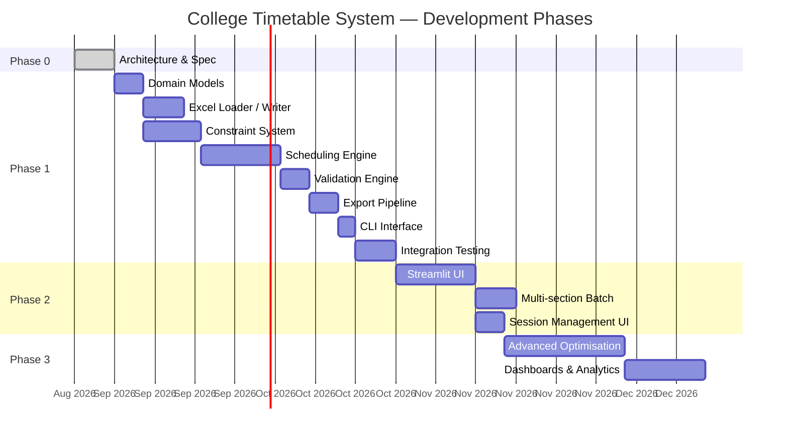

# Future Roadmap

> **Version:** 1.0-DRAFT  
> **Date:** 2026-08-30  
> **Companion to:** `PROJECT_SPEC.md`, `ARCHITECTURE.md`

---

## Phase Overview

---

## Phase 1 — Core Engine (CLI)

> **Goal:** A working command-line scheduling system that reads master data, accepts setup configuration, generates a conflict-free timetable, validates it, and exports to Excel.

### Milestone 1.1 — Data Foundation

| Task | Description | Output |
|---|---|---|
| Domain models | Implement all dataclasses (`Teacher`, `Room`, `Subject`, `Workload`, `Assignment`, `Placement`, etc.) | `college_timetable/models/` |
| Excel loader | Read all 4 master files from `Data/` into model objects with validation. | `college_timetable/data/loader.py` |
| Data validator | Implement all V-* checks from `DATA_SCHEMA.md`. | `college_timetable/data/validators.py` |

> [!NOTE]
> **Data migration is complete.** All 4 master files (`teachers.xlsx`, `rooms.xlsx`, `subjects.xlsx`, `workloads.xlsx`) are already normalised in `Data/`. No migration scripts needed.

### Milestone 1.2 — Constraint & Engine

| Task | Description | Output |
|---|---|---|
| Constraint base | Abstract `Constraint` class + `ConstraintRegistry`. | `college_timetable/constraints/base.py` |
| Hard constraints | C1–C8 implementations. | `college_timetable/constraints/*.py` |
| Schedule state | `ScheduleState` with occupancy maps. | `college_timetable/engine/state.py` |
| Scheduler | Main scheduling loop with backtracking. | `college_timetable/engine/scheduler.py` |
| Block placer | Consecutive slot placement + parallel G1/G2 handling. | `college_timetable/engine/block_placer.py` |

### Milestone 1.3 — Validation & Export

| Task | Description | Output |
|---|---|---|
| Validation engine | Independent post-hoc re-check of all constraints. | `college_timetable/validation/` |
| Section exporter | Per-section timetable to formatted Excel. | `college_timetable/export/section_exporter.py` |
| Teacher exporter | Per-teacher schedule to Excel. | `college_timetable/export/teacher_exporter.py` |
| Summary exporter | Room utilisation + workload summary. | `college_timetable/export/summary_exporter.py` |

### Milestone 1.4 — CLI & Integration

| Task | Description | Output |
|---|---|---|
| CLI interface | `click`-based commands: `load`, `setup`, `schedule`, `validate`, `export`. | `college_timetable/main.py` |
| Integration tests | End-to-end test: load → setup → schedule → validate → export for at least 2 branch-semester combinations. | `tests/` |
| Documentation | Usage guide, README. | `README.md` |

---

## Phase 2 — User Interface

> **Goal:** A visual interface for setup, generation, review, and export.

### 2.1 Streamlit UI

| Feature | Description |
|---|---|
| Dashboard | Overview of loaded master data: teacher counts, room inventory, subject catalogue. |
| Setup wizard | Step-by-step: select session → branch → semester → create sections → assign teachers → set block sizes. |
| Schedule viewer | Interactive 5×7 grid per section. Click a cell to see assignment details. Colour-coded by activity type. |
| Teacher viewer | Select a teacher → see their full weekly schedule across all sections. |
| Room viewer | Select a room → see its occupancy across the week. |
| Conflict highlights | Red cells for any validation errors; yellow for warnings. |
| Export controls | Button to export selected timetable(s) to Excel. |

### 2.2 Multi-Section Batch Scheduling

| Feature | Description |
|---|---|
| Batch generation | Schedule multiple sections in sequence, respecting cross-section constraints (shared teachers, shared rooms). |
| Priority ordering | User selects the order in which sections are scheduled (earlier = higher priority for room/slot choices). |
| Conflict dashboard | After batch generation, show a cross-section conflict summary. |

### 2.3 Session Management

| Feature | Description |
|---|---|
| Session CRUD | Create, rename, clone, archive sessions. |
| Clone session | Copy assignments from a previous session as a starting point for the new term. |
| Diff view | Compare two sessions to see what changed (teacher reassignments, new subjects). |

---

## Phase 3 — Advanced Optimisation & Analytics

> **Goal:** Move beyond "find any valid timetable" to "find the best valid timetable."

### 3.1 Optimisation Enhancements

| Feature | Description |
|---|---|
| Soft-constraint scoring | Assign numerical penalties for soft-constraint violations. Engine minimises total penalty score. |
| Multi-restart | Run the scheduler N times with different random seeds, pick the result with the lowest penalty score. |
| Simulated annealing | After finding a valid timetable, apply local swaps to improve soft-constraint satisfaction. |
| ILP solver (optional) | Formulate scheduling as an Integer Linear Program using `PuLP` or `OR-Tools` for provably optimal solutions. |

### 3.2 Teacher Preferences

| Feature | Description |
|---|---|
| Availability windows | Teachers can mark slots as "unavailable" or "preferred". |
| Max consecutive periods | Soft limit on how many consecutive periods a teacher teaches without a break. |
| Day-off preference | Teacher requests a free day (e.g., "no classes on Friday"). |

### 3.3 Dashboards & Analytics

| Feature | Description |
|---|---|
| Room utilisation heatmap | Visual grid showing occupancy rate of every room across the week. Identify underused rooms. |
| Teacher load balance | Bar chart comparing total periods across teachers in a department. Flag imbalances. |
| Free-slot analysis | Identify common free slots across sections (for rescheduling or college-wide events). |
| Historical comparison | Compare current semester's timetable against previous semesters. |

---

## Phase 4 — Enterprise Features (Long-Term Vision)

> These features are aspirational and depend on adoption success.

| Feature | Description | Complexity |
|---|---|---|
| **Database backend** | Migrate from Excel to SQLite / PostgreSQL for better concurrency, querying, and audit trails. | Medium |
| **Multi-user access** | Web app with role-based access: Admin, HOD (per department), Faculty (view own schedule). | High |
| **Substitution management** | When a teacher is absent, find available substitutes based on real-time timetable. | Medium |
| **Attendance integration** | Record attendance per slot; generate reports. | Medium |
| **Student portal** | Students view their section's timetable; receive notifications for changes. | Medium |
| **Mobile app** | Companion mobile app for teachers and students. | High |
| **Exam scheduling** | Extend the engine to schedule exam timetables with invigilation duty assignment. | High |
| **Calendar sync** | Export timetable to Google Calendar / Outlook. | Low |
| **PDF export** | Generate print-ready timetable PDFs with college branding. | Low |
| **Automatic teacher assignment** | Given subject-teacher competency data, auto-assign teachers to subjects to balance load. | High |
| **Constraint learning** | Analyse past successful timetables to learn implicit preferences and constraints. | Research |

---

## Technical Debt & Improvement Backlog

| Item | Description | Priority |
|---|---|---|
| Workshop room data | Workshop rooms are missing from `rooms.xlsx`. Need college input. | **High** — blocks workshop scheduling. |
| VF teacher resolution | `VF1`–`VF5` placeholders need to be replaced with real names each semester. | **High** — affects real timetable generation. |
| SCA period handling | SCA is excluded from data; free periods (35 minus workload) are unscheduled. Confirm this is correct. | Medium |
| Cross-department subject sharing | No explicit flag in data. Sharing is inferred from teacher dept vs subject branch at setup. Confirm this is sufficient. | Medium |
| Capacity modelling | Rooms currently have no `capacity` field. If sections vary in size, room-student fit may matter. | Low (all sections likely same size). |
| Undo/redo in UI | Ability to manually adjust a generated timetable and undo changes. | Phase 2 |

---

## Dependencies & Prerequisites

| Dependency | Status | Needed By |
|---|---|---|
| Python 3.10+ | ✅ Available | Phase 1 |
| `openpyxl` | ✅ Available | Phase 1 |
| `click` | Install needed | Phase 1 |
| `pytest` | Install needed | Phase 1 |
| `pydantic` (optional) | Install needed | Phase 1 |
| `streamlit` | Install needed | Phase 2 |
| `OR-Tools` / `PuLP` (optional) | Install needed | Phase 3 |

---

## Risk Register

| Risk | Impact | Likelihood | Mitigation |
|---|---|---|---|
| Infeasible timetable (no valid solution exists for a given set of constraints) | High — system appears broken | Medium | Diagnostics engine explains why; suggest constraint relaxation. |
| Drawing hall bottleneck (2 rooms, many branches need Engineering Graphics) | Medium — some sections can't be scheduled | High | Prioritise DH placements; allow lunch-span for DH if needed. |
| Workshop room data unavailable | Medium — cannot schedule WS activities | High | Flag as placeholder; schedule workshops last. |
| VF teachers not replaced before scheduling | Low — timetable generates but with dummy names | High | Warn during validation; allow export with warnings. |
| Block-size assumptions wrong | Medium — timetable doesn't match college practice | Medium | All block sizes are configurable; no hard-coded assumptions. |
| Performance (large backtrack space) | Low — slow generation | Low | Add randomisation + multi-restart; consider ILP in Phase 3. |
