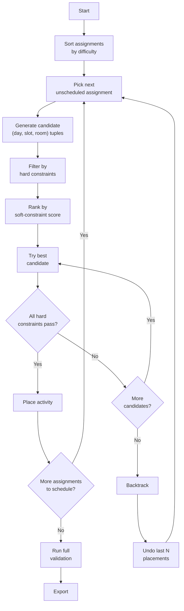
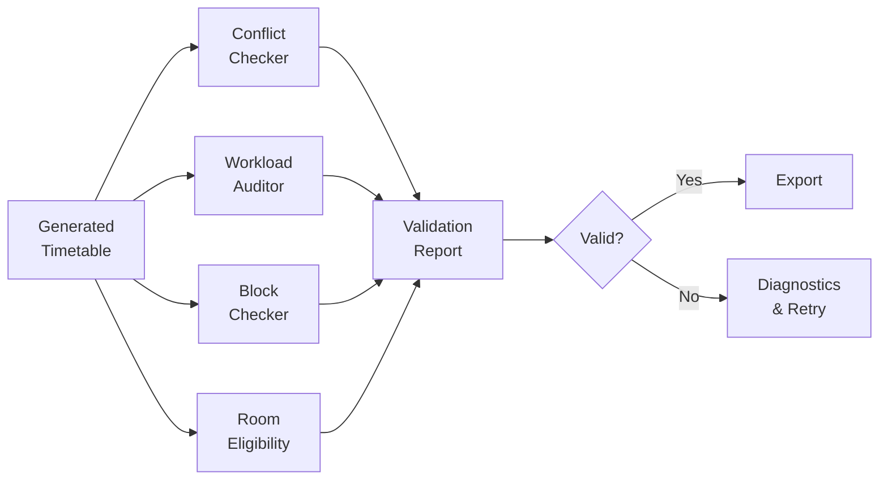

# Scheduling Rules Specification

> **Version:** 1.0-DRAFT  
> **Date:** 2026-08-30  
> **Companion to:** `PROJECT_SPEC.md`, `ARCHITECTURE.md`

---

## 1. Rule Classification

Every scheduling rule is classified as either:

- **HARD** — Must never be violated. A timetable with any hard-constraint violation is **invalid** and cannot be exported.
- **SOFT** — Desirable but negotiable. The engine optimises for soft constraints after satisfying all hard constraints.
- **CONFIGURABLE** — The rule's parameters can be adjusted per session. Marked with ⚙️.

---

## 2. Hard Constraints

### C1 — Teacher Non-Overlap

> **A teacher cannot be assigned to two different activities in the same time-slot.**

| Property | Value |
|---|---|
| Scope | Global (across all branches, sections, groups) |
| Check | For any `TimeSlot(day, period)`, at most one `Placement` references a given `teacher_id`. |
| Violation severity | **FATAL** — timetable invalid |

**Edge case:** A teacher assigned to both G1 and G2 of the *same* subject in the *same* slot is a violation (this means they're supposed to be in two labs simultaneously). Parallel G1/G2 practicals of the same subject require **two different teachers**.

---

### C2 — Room Non-Overlap

> **A room cannot host two different activities in the same time-slot.**

| Property | Value |
|---|---|
| Scope | Global |
| Check | For any `TimeSlot(day, period)`, at most one `Placement` references a given `room_id`. |
| Violation severity | **FATAL** |

---

### C3 — Section/Group Non-Overlap

> **A section (or group within a section) cannot have two activities scheduled in the same time-slot.**

| Property | Value |
|---|---|
| Scope | Per section |
| Check | See logic below |

**Detailed logic:**

```
For a proposed Placement P for (section=S, group=G) at TimeSlot T:

IF G == "ALL":
    # Lecture for full section — no one in section should be busy
    T must not appear in section_slots[S]["ALL"]
    T must not appear in section_slots[S]["G1"]
    T must not appear in section_slots[S]["G2"]

IF G == "G1":
    T must not appear in section_slots[S]["ALL"]   # no full-section activity
    T must not appear in section_slots[S]["G1"]     # no other G1 activity
    # G2 may have an activity — that's fine (parallel practicals)

IF G == "G2":
    T must not appear in section_slots[S]["ALL"]
    T must not appear in section_slots[S]["G2"]
    # G1 may have an activity — that's fine
```

---

### C4 — Workload Fulfilment

> **Every assignment's required weekly sessions must be fully placed.**

| Property | Value |
|---|---|
| Scope | Per assignment |
| Check | `count(placements for assignment_id) == assignment.sessions_per_week` |
| Timing | Checked after scheduling completes (not per-placement). |

**For subjects with both L and P components:**

The subject is represented as **two separate assignments** — one `LECTURE` type and one `PRACTICAL` type — each with their own `sessions_per_week`.

Example — "Fundamentals of IT" (CSE Sem 1, L=2, P=4):
- Assignment 1: `activity_type=LECTURE, block_size=1, sessions_per_week=2`
- Assignment 2: `activity_type=PRACTICAL, block_size=2, sessions_per_week=2` ⚙️

---

### C5 — Consecutive Slot Blocks ⚙️

> **Practical, workshop, and drawing sessions must occupy consecutive time-slots on the same day.**

| Property | Value |
|---|---|
| Scope | Per placement |
| Parameters | `block_size` (from assignment) |
| Check | All slots in a placement satisfy: same `day`, and `period` values form a contiguous sequence with no gaps. |

**Lunch break rule:**

A block **cannot span the lunch break** (slot 4 → slot 5) unless `allow_lunch_span` is set to `true` in configuration.

Valid block positions (block_size=2):

```
Slots 1-2 ✅    Slots 2-3 ✅    Slots 3-4 ✅
Slots 4-5 ❌ (lunch gap)
Slots 5-6 ✅    Slots 6-7 ✅
```

Valid block positions (block_size=3):

```
Slots 1-3 ✅    Slots 2-4 ✅
Slots 3-5 ❌ (lunch gap)    Slots 4-6 ❌ (lunch gap)
Slots 5-7 ✅
```

> [!IMPORTANT]
> **UNRESOLVED:** The exact block sizes for practicals, workshops, and drawing sessions have **not been confirmed** by the college.
> 
> Observed practical period counts from source data include: 2, 4, 6, 8, 12, 14, 16 per week.  
> A practical with P=4/week could be:
> - 2 sessions × block_size=2, OR
> - 1 session × block_size=4
>
> The `block_size` must be set per-subject during timetable setup. The system provides a configurable default of `2`.

---

### C6 — Parallel Group Alignment

> **When G1 and G2 of the same subject-section have practicals, they must occupy the exact same day and slot range.**

| Property | Value |
|---|---|
| Scope | Per subject-section pair |
| Check | If assignments A_G1 and A_G2 exist for same (subject_id, section) with groups G1 and G2, then every placement of A_G1 at (day, start_slot, end_slot) must have a corresponding placement of A_G2 at the *same* (day, start_slot, end_slot). |

**Rationale:** From the section's perspective, the G1/G2 slot is "occupied" — both groups are busy, just in different rooms with different teachers.

**Scheduling strategy:** The engine treats parallel G1/G2 practicals as a **compound unit** — it picks one (day, slot_range) and then simultaneously assigns G1 to Room_A with Teacher_X and G2 to Room_B with Teacher_Y. This guarantees alignment and simplifies backtracking.

---

### C7 — Room-Type Eligibility

> **Activities can only be placed in rooms of the correct type.**

| Activity Type | Eligible Room Types | Additional Rule |
|---|---|---|
| `LECTURE` | `LECTURE` | Any L1–L13 (shared, no branch restriction). |
| `PRACTICAL` | `LAB` | Room's `branch` must match the section's branch. |
| `WORKSHOP` | `WORKSHOP` | Shared — any workshop room. |
| `DRAWING` | `DRAWING_HALL` | Shared — DH1 or DH2. |

> [!NOTE]
> Some practicals tagged with `**` or `***` in the source data may need a room from a different branch's labs.  
> Example: CSE students doing "Electronics Workshop" may need an ECE/EE lab.  
> This is handled by explicitly setting `room_id` in the `Assignment` during setup.

---

### C8 — Drawing Hall Availability

> **Drawing halls (DH1, DH2) are shared resources and must be conflict-checked like any room.**

This is a special case of C2, but called out explicitly because:
- Multiple branches need drawing halls (ME, CE, EE, ECE — for Engineering Graphics).
- With only 2 halls and potentially 5+ sections needing 6 periods/week each, scheduling pressure is high.
- The engine should prioritise drawing-hall placements early (they are the most constrained shared resource).

---

## 3. Soft Constraints

### S1 — Teacher Daily Load Limit ⚙️

> **A teacher should not teach more than `max_periods_per_day_teacher` periods in a single day.**

| Property | Value |
|---|---|
| Default | 6 periods |
| Behaviour | Engine tries to avoid; may violate if no other placement is possible. |
| Penalty | Adds to soft-constraint score (lower is better). |

---

### S2 — Section Daily Lecture Limit ⚙️

> **A section should not have more than `max_lectures_per_day` theory lectures in a single day.**

| Property | Value |
|---|---|
| Default | 5 lectures |
| Behaviour | Preference only — engine attempts even distribution. |

---

### S3 — Subject Distribution

> **A subject's sessions should be spread across the week, not clustered on the same day.**

| Property | Value |
|---|---|
| Check | For a subject with `sessions_per_week=N`, the `N` sessions should ideally be on `N` different days. |
| Behaviour | Preference — engine avoids placing two lectures of the same subject on the same day. |

---

### S4 — Teacher Gap Minimisation

> **Minimise idle gaps ("free periods") between a teacher's classes on the same day.**

| Property | Value |
|---|---|
| Check | If a teacher has classes in periods 1 and 4, that's a 2-period gap (periods 2 and 3 are idle). |
| Behaviour | Preference — engine tries to pack a teacher's daily schedule contiguously. |

---

### S5 — Morning Preference for Theory

> **Theory lectures are preferably scheduled in the morning slots (1–4).**

| Property | Value |
|---|---|
| Behaviour | Low-priority preference. Practicals often naturally fill afternoon slots due to block-size requirements. |

---

## 4. Scheduling Algorithm

### 4.1 Strategy: Constraint-Satisfaction with Prioritised Backtracking



### 4.2 Assignment Priority Order

Assignments are sorted by **difficulty** (most constrained first) to reduce backtracking:

| Priority | Assignment Type | Rationale |
|---|---|---|
| 1 (hardest) | Drawing sessions (block_size=3+, only 2 rooms) | Extreme room scarcity. |
| 2 | Workshop sessions (block_size=3+, shared rooms) | Room scarcity + large blocks. |
| 3 | Parallel G1/G2 practicals (compound units) | Need 2 rooms + 2 teachers simultaneously. |
| 4 | Single-group practicals (block_size=2+) | Need consecutive slots + specific lab. |
| 5 | Lectures with shared-department teachers | Teacher more likely to have cross-section conflicts. |
| 6 (easiest) | Lectures with department-specific teachers | Most flexible — any lecture room, single slot. |

### 4.3 Candidate Generation

For each assignment, candidates are generated as follows:

```python
def generate_candidates(assignment, state, rooms):
    eligible_rooms = filter_by_type_and_branch(rooms, assignment)
    candidates = []

    for day in [MON, TUE, WED, THU, FRI]:
        for start_slot in valid_start_positions(assignment.block_size):
            slot_range = range(start_slot, start_slot + assignment.block_size)

            for room in eligible_rooms:
                if (state.is_teacher_free(assignment.teacher_id, day, slot_range) and
                    state.is_room_free(room.room_id, day, slot_range) and
                    state.is_section_free(assignment.section, assignment.group, day, slot_range)):
                    
                    score = compute_soft_score(assignment, day, slot_range, room, state)
                    candidates.append((day, start_slot, room, score))

    return sorted(candidates, key=lambda c: c.score)
```

### 4.4 Backtracking Strategy

When no candidate is found for an assignment:

1. **Undo the most recent placement** and try alternate candidates for it.
2. If that assignment also has no alternatives, undo another level (recursive).
3. Track **backtrack depth** — if it exceeds `max_backtrack_attempts`, report failure with diagnostics:
   - Which assignment couldn't be placed.
   - What constraints blocked all candidates.
   - Suggested relaxation (e.g., "Consider adding another lecture room" or "Reduce block size for subject X").

### 4.5 Parallel Group Scheduling

Parallel G1/G2 practicals are treated as **atomic compound placements**:

```python
def schedule_parallel_group(g1_assignment, g2_assignment, state):
    # Both assignments share the same section, subject, block_size
    g1_rooms = eligible_rooms(g1_assignment)
    g2_rooms = eligible_rooms(g2_assignment)

    for day in days:
        for start_slot in valid_starts(block_size):
            slot_range = range(start_slot, start_slot + block_size)

            # Section must be free (checked against ALL and both groups)
            if not state.is_section_free(section, "ALL", day, slot_range):
                continue

            # Try all room combinations
            for r1 in g1_rooms:
                if not state.is_room_free(r1, day, slot_range):
                    continue
                if not state.is_teacher_free(g1_assignment.teacher_id, day, slot_range):
                    continue

                for r2 in g2_rooms:
                    if r2 == r1:
                        continue  # Can't use same room
                    if not state.is_room_free(r2, day, slot_range):
                        continue
                    if not state.is_teacher_free(g2_assignment.teacher_id, day, slot_range):
                        continue

                    # Valid compound placement found
                    return place_both(g1_assignment, r1, g2_assignment, r2, day, start_slot)
```

---

## 5. Conflict Detection Architecture

### 5.1 Real-Time Detection (During Scheduling)

Conflicts are detected **before** each placement attempt using the `ScheduleState` occupancy maps:

```
ScheduleState
├── teacher_slots:  Dict[teacher_id → Set[TimeSlot]]
├── room_slots:     Dict[room_id → Set[TimeSlot]]
└── section_slots:  Dict[(section, group) → Set[TimeSlot]]
```

All lookups are **O(1)** set membership checks per slot.

For a placement spanning `block_size` slots, the check is O(block_size) — effectively O(1) since block_size ≤ 7.

### 5.2 Post-Hoc Detection (Validation Pass)

After scheduling completes, the validation engine performs an **independent full scan**:

```python
def detect_all_conflicts(placements: List[Placement]) -> List[Conflict]:
    conflicts = []

    # Build fresh occupancy maps from scratch
    teacher_map = defaultdict(list)  # teacher_id → List[Placement]
    room_map = defaultdict(list)
    section_map = defaultdict(list)

    for p in placements:
        for slot in p.slots:
            key_t = (p.assignment.teacher_id, slot)
            key_r = (p.room_id, slot)
            key_s = (p.assignment.section, p.assignment.group, slot)

            if key_t in teacher_map:
                conflicts.append(TeacherConflict(p, teacher_map[key_t], slot))
            teacher_map[key_t].append(p)

            if key_r in room_map:
                conflicts.append(RoomConflict(p, room_map[key_r], slot))
            room_map[key_r].append(p)

            # Section conflict: check ALL vs G1/G2 interaction
            ...

    return conflicts
```

This independent check guards against engine bugs — it uses **no state from the engine**, only the final placement list.

---

## 6. Validation Architecture

### 6.1 Validation Pipeline



### 6.2 Validation Checks (Complete List)

| ID | Category | Severity | Description |
|---|---|---|---|
| VT-1 | Conflict | ERROR | Teacher scheduled in two places at same time. |
| VT-2 | Conflict | ERROR | Room double-booked. |
| VT-3 | Conflict | ERROR | Section/group has overlapping activities. |
| VT-4 | Workload | ERROR | Subject has fewer sessions than required. |
| VT-5 | Workload | ERROR | Subject has more sessions than required. |
| VT-6 | Block | ERROR | Practical block has non-consecutive slots. |
| VT-7 | Block | ERROR | Block spans lunch break (when not allowed). |
| VT-8 | Alignment | ERROR | G1/G2 parallel practicals not aligned. |
| VT-9 | Room | ERROR | Activity placed in wrong room type. |
| VT-10 | Room | ERROR | Practical placed in lab of wrong branch. |
| VT-11 | Load | WARNING | Teacher exceeds daily period limit. |
| VT-12 | Load | WARNING | Section exceeds daily lecture limit. |
| VT-13 | Distribution | WARNING | Subject sessions clustered on same day. |
| VT-14 | Gap | WARNING | Teacher has idle gaps between classes. |
| VT-15 | Coverage | INFO | Free/unscheduled slots in section grid. |

---

## 7. Export Architecture

### 7.1 Export Pipeline

```python
class ExportPipeline:
    def export(self, timetable: Timetable, session: Session):
        report = self.validator.validate(timetable)

        if not report.is_valid:
            raise ExportBlockedError(report.errors)

        # Generate per-section files
        for section in timetable.sections:
            self.section_exporter.export(section, output_dir)

        # Generate per-teacher files
        for teacher in timetable.teachers:
            self.teacher_exporter.export(teacher, output_dir)

        # Generate summary
        self.summary_exporter.export(timetable, output_dir)

        # Log warnings
        if report.warnings:
            self.log_warnings(report.warnings)
```

### 7.2 Export Formats

| Export | File | Content |
|---|---|---|
| Section timetable | `{Branch}_{Sem}_{Section}.xlsx` | 5×7 grid with subject/teacher/room per cell. |
| Teacher schedule | `Teacher_{Name}.xlsx` | 5×7 grid showing teacher's classes across all sections. |
| Room utilisation | `Room_Utilisation.xlsx` | Matrix of rooms × time-slots → occupancy. |
| Workload summary | `Workload_Summary.xlsx` | Teacher → total periods, section → L vs P breakdown. |
| Validation report | `Validation_Report.xlsx` | All checks with pass/fail/warning status. |

### 7.3 Cell Formatting

```
┌─────────────────────┐
│  Applied Maths-I    │  ← Subject name
│  MT                 │  ← Teacher initials
│  L5                 │  ← Room
│  [G1]               │  ← Group (if applicable)
└─────────────────────┘
```

Colour coding:
- 🔵 **Blue** — Lecture
- 🟢 **Green** — Practical/Lab
- 🟡 **Yellow** — Workshop
- 🟠 **Orange** — Drawing
- ⬜ **Grey** — Free / SCA
- 🔴 **Red** — Conflict (in validation report)

---

## 8. Unresolved Rules Requiring Clarification

> [!CAUTION]
> The following business rules are **not confirmed** and are marked as **configurable** in the system.  
> They must be resolved with the college administration before production use.

| # | Question | Current Default | Impact |
|---|---|---|---|
| U1 | What is the standard block size for branch practicals? (2 or 3 consecutive periods?) | `practical_block_size = 2` | Affects slot availability and scheduling feasibility. |
| U2 | What is the block size for workshop sessions? | `workshop_block_size = 3` | Workshops typically run longer but exact rule unknown. |
| U3 | What is the block size for drawing hall sessions? (Engineering Graphics is always P=6/week) | `drawing_block_size = 3` | With only 2 drawing halls, block size dramatically affects feasibility. |
| U4 | Can a practical block span the lunch break? | `allow_lunch_span = false` | If true, opens up slot 4→5 as a valid block transition. |
| U5 | SCA is excluded from `workloads.xlsx`. Are the remaining free periods (35 minus workload total) left unscheduled, or should they be labelled as "SCA" on the timetable? | `schedule_sca = false` — free periods are left blank | Affects how the exported timetable looks — blank cells vs labelled "SCA". |
| U6 | Are MOOCs/Open Electives scheduled into specific slots or handled outside the timetable? | `schedule_moocs = false` | Affects workload counting and slot usage. |
| U7 | Is Project / Industrial Training scheduled into the timetable or handled separately? | Not scheduled | Sem 4–6 have project/training with large P values (6–16). |
| U8 | Can a teacher from one department teach in more than one branch simultaneously in the same semester? | Yes (handled via assignments) | Affects cross-department conflict detection. |
| U9 | What are the specific workshop rooms? | Not yet in rooms data | Cannot schedule WORKSHOP activities until room data is provided. |
| U10 | Are there any teacher-specific time preferences (e.g., "Prof. X only available mornings")? | Not modelled | Could be added as soft constraints. |
